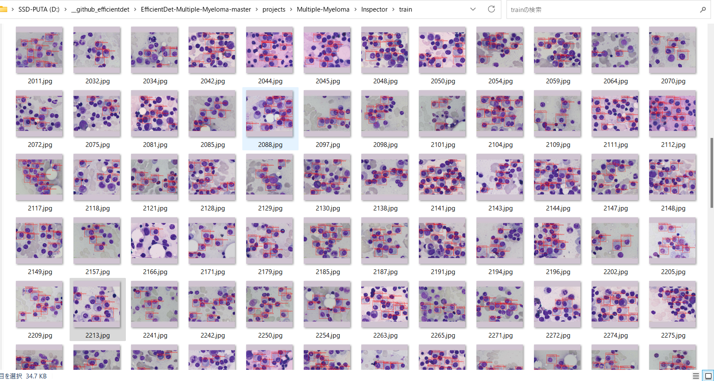
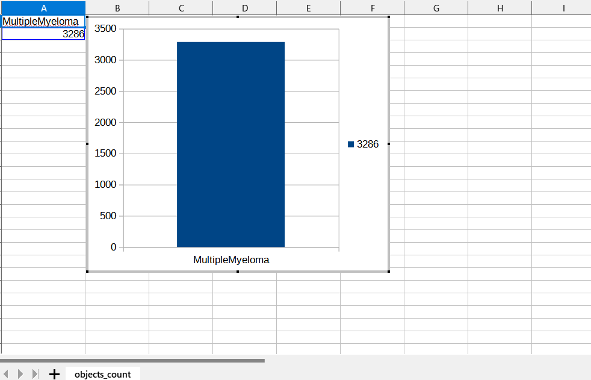
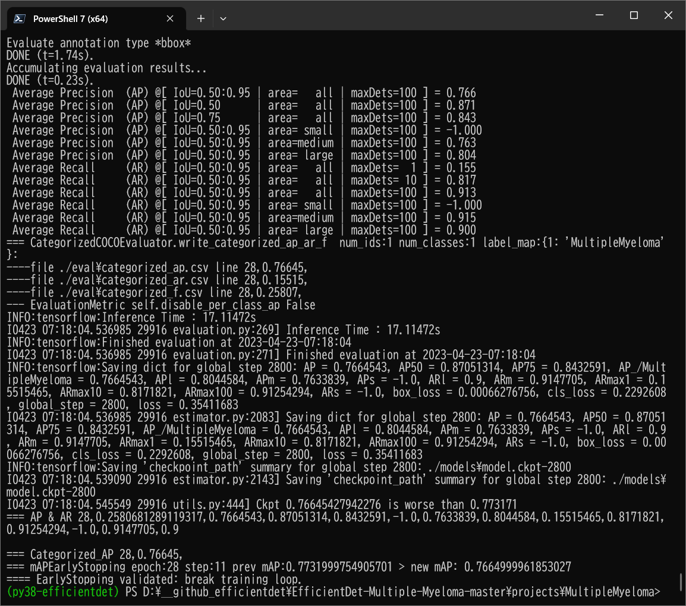
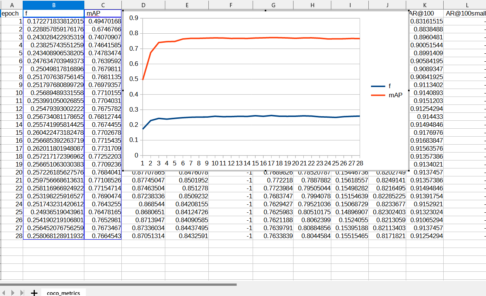
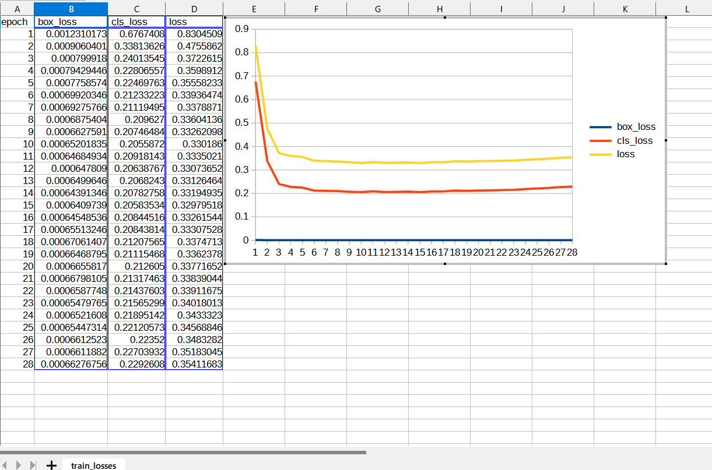

<h2>
EfficientDet-Multiple-Myeloma (Updated: 2023/04/25)
</h2>
This is an experimental project to detect <b>Multiple-Myeloma</b> based on 
Microscopic Images of Multiple-Myeloma (TCIA_SegPC_dataset), by using Google Brain AutoML
<a href="https://github.com/google/automl/tree/master/efficientdet"> EfficientDet.</a> 
The original dataset used here has been take from the following  web site: 
<b>SegPC-2021-dataset</b> 
SegPC-2021: Segmentation of Multiple Myeloma Plasma Cells in Microscopic Images 

<pre>
https://www.kaggle.com/datasets/sbilab/segpc2021dataset
</pre>
Citation: 

<pre>
Anubha Gupta, Ritu Gupta, Shiv Gehlot, Shubham Goswami, April 29, 2021, 
"SegPC-2021: Segmentation of Multiple Myeloma Plasma Cells in Microscopic Images", IEEE Dataport, doi: https://dx.doi.org/10.21227/7np1-2q42.

BibTex
@data{segpc2021,
doi = {10.21227/7np1-2q42},
url = {https://dx.doi.org/10.21227/7np1-2q42},
author = {Anubha Gupta; Ritu Gupta; Shiv Gehlot; Shubham Goswami },
publisher = {IEEE Dataport},
title = {SegPC-2021: Segmentation of Multiple Myeloma Plasma Cells in Microscopic Images},
year = {2021} }

IMPORTANT:
If you use this dataset, please cite below publications-

1. Anubha Gupta, Rahul Duggal, Shiv Gehlot, Ritu Gupta, Anvit Mangal, Lalit Kumar, Nisarg Thakkar, and Devprakash Satpathy, 
 "GCTI-SN: Geometry-Inspired Chemical and Tissue Invariant Stain Normalization of Microscopic Medical Images," 
 Medical Image Analysis, vol. 65, Oct 2020. DOI: 
 (2020 IF: 11.148)
2. Shiv Gehlot, Anubha Gupta and Ritu Gupta, 
 "EDNFC-Net: Convolutional Neural Network with Nested Feature Concatenation for Nuclei-Instance Segmentation,"
 ICASSP 2020 - 2020 IEEE International Conference on Acoustics, Speech and Signal Processing (ICASSP), 
 Barcelona, Spain, 2020, pp. 1389-1393.
3. Anubha Gupta, Pramit Mallick, Ojaswa Sharma, Ritu Gupta, and Rahul Duggal, 
 "PCSeg: Color model driven probabilistic multiphase level set based tool for plasma cell segmentation in multiple myeloma," 
 PLoS ONE 13(12): e0207908, Dec 2018. DOI: 10.1371/journal.pone.0207908

License
CC BY-NC-SA 4.0

</pre>

<h2>
1. Installing tensorflow on Windows11
</h2>
We use Python 3.8.10 to run tensoflow 2.11.1 on Windows11. 
<h3>1.1 Install Microsoft Visual Studio Community</h3>
Please install <a href="https://visualstudio.microsoft.com/ja/vs/community/">Microsoft Visual Studio Community</a>, 
which can be ITed to compile source code of 
<a href="https://github.com/cocodataset/cocoapi">cocoapi</a> for PythonAPI. 
<h3>1.2 Create a python virtualenv </h3>
Please run the following command to create a python virtualenv of name <b>py38-efficientdet</b>.
<pre>
>cd c:\
>python38\python.exe -m venv py38-efficientdet
>cd c:\py38-efficientdet
>./scripts/activate
</pre>
<h3>1.3 Create a working folder </h3>
Please create a working folder "c:\google" for your repository, and install the python packages. 

<pre>
>mkdir c:\google
>cd    c:\google
>pip install cython
>git clone https://github.com/cocodataset/cocoapi
>cd cocoapi/PythonAPI
</pre>
You have to modify extra_compiler_args in setup.py in the following way:
<pre>
   extra_compile_args=[]
</pre>
<pre>
>python setup.py build_ext install
</pre>

 
<h2>
2. Installing EfficientDet-Multiple-Myeloma
</h2>
<h3>2.1 Clone repository</h3>
Please clone EfficientDet-Multiple-Myeloma.git in the working folder <b>c:\google</b>. 
<pre>
>git clone https://github.com/sarah-antillia/EfficientDet-Multiple-Myeloma.git 
</pre>
You can see the following folder <b>projects</b> in EfficientDet-Multiple-Myeloma of the working folder. 

<pre>
EfficientDet-Multiple-Myeloma
└─projects
      └─Multiple-Myeloma
          ├─eval
          ├─saved_model
          ├─mini-test
          ├─mini-test_outputs
          ├─train
          └─valid
</pre>
<h3>2.2 Install python packages</h3>

Please run the following command to install python packages for this project. 
<pre>
>cd ./EfficientDet-Multiple-Myeloma
>pip install -r requirements.txt
</pre>

 
<h3>2.3 Create TFRecord dataset</h3>
<h3>
1, Create YOLO annotation
</h3>
 We have created <b>Multiple-Myeloma YOLO</b> annotation dataset from <b>train</b> and <b>validation</b> dataset of <b>TCIA_SegPC_dataset</b> by using the following Python script. 
<a href="./projects/Multiple-Myeloma/YOLOAnnotationGenerator.py">YOLOAnnotationGenerator.py</a> 

<pre>
./YOLO/
├─train/
└─valid/
</pre>

In order to create YOLO annotation, this script will do the following image processings. 
<b> 1 Resize image size</b> 
 The bmp image size in the original dataset is 2560x1920 in pixel, which is too big to use 
as the train and valid image dataset for our EfficientDet model. Therefore we have resized
all images in x and y folders in those dataset to be 512x512.  
<b> 2 Compute bounding boxes</b> 
 We have computed the bounding boxes from the instance segmentations of the resized image in y folder 
in train and valid dataset.  
<b> 3 Create YOLO annotation</b> 
 We have created YOLO annotation files from the bounding boxes. 
 
<h3>
2. Convert YOLO to TFRecord
</h3>
 We have created <b>TFRecord</b> dataset from <b>Multiple-Myeloma YOLO</b> train and valid dataset by using 
 <a href="https://github.com/sarah-antillia/AnnotationConverters/blob/main/YOLO2TFRecordConverter.py">YOLO2TFRecordConverter.py </a>.
 

<h3>2.4 Workarounds for Windows</h3>
As you know or may not know, the efficientdet scripts of training a model and creating a saved_model do not 
run well on Windows environment in case of tensorflow 2.8.0 (probably after the version 2.5.0) as shown below:. 
<pre>
INFO:tensorflow:Saving checkpoints for 0 into ./models\model.ckpt.
I0609 06:22:50.961521  3404 basic_session_run_hooks.py:634] Saving checkpoints for 0 into ./models\model.ckpt.
2022-06-09 06:22:52.780440: W tensorflow/core/framework/op_kernel.cc:1745] OP_REQUIRES failed at save_restore_v2_ops.cc:110 :
 NOT_FOUND: Failed to create a NewWriteableFile: ./models\model.ckpt-0_temp\part-00000-of-00001.data-00000-of-00001.tempstate8184773265919876648 :
</pre>

The real problem seems to happen in the original <b> save_restore_v2_ops.cc</b>. The simple workarounds to the issues are 
to modify the following tensorflow/python scripts in your virutalenv folder. 
<pre>
c:\py38-efficientdet\Lib\site-packages\tensorflow\python\training
 +- basic_session_run_hooks.py
 
634    logging.info("Saving checkpoints for %d into %s.", step, self._save_path)
635    ### workaround date="2022/06/18" os="Windows"
636    import platform
637    if platform.system() == "Windows":
638      self._save_path = self._save_path.replace("/", "\\")
639    #### workaround
</pre>

<pre>
c:\py38-efficientdet\Lib\site-packages\tensorflow\python\saved_model
 +- builder_impl.py

595    variables_path = saved_model_utils.get_variables_path(self._export_dir)
596    ### workaround date="2022/06/18" os="Windows" 
597    import platform
598    if platform.system() == "Windows":
599      variables_path = variables_path.replace("/", "\\")
600    ### workaround
</pre>
 
<h3>3. Inspect tfrecord</h3>
  Move to ./projects/IT_RoadSigns directory, and run the following bat file: 
<pre>
tfrecord_inspect.bat
</pre>
, which is the following:
<pre>
python ../../TFRecordInspector.py ^
  ./train/*.tfrecord ^
  ./label_map.pbtxt ^
  ./Inspector/train
</pre>
 
This will generate annotated images with bboxes and labels from the tfrecord, and cout the number of annotated objects in it. 
 
<b>TFRecordInspecotr: annotated images in train.tfrecord</b> 

 
 
<b>TFRecordInspecotr: objects_count train.tfrecord</b> 

 
This bar graph shows that the number of the objects contained in train.tfrecord.
 
 
 
<h3>4. Downloading the pretrained-model efficientdet-d0</h3>
Please download an EfficientDet model chekcpoint file <b>efficientdet-d0.tar.gz</b>, and expand it in <b>EfficientDet-IT-RoadSigns</b> folder. 
 
https://storage.googleapis.com/cloud-tpu-checkpoints/efficientdet/coco2/efficientdet-d0.tar.gz
 
See: https://github.com/google/automl/tree/master/efficientdet 

<h3>5. Training Multiple-Myeloma Model by using the pretrained-model</h3>
Please change your current directory to <b>./projects/Multiple-Myeloma</b>,
and run the following bat file to train Multiple-Myeloma EfficientDet Model by using the train and valid tfrecords.
<pre>
1_train.bat
</pre>

<pre>
rem 1_train.bat
python ../../ModelTrainer.py ^
  --mode=train_and_eval ^
  --train_file_pattern=./train/*.tfrecord  ^
  --val_file_pattern=./valid/*.tfrecord ^
  --model_name=efficientdet-d0 ^
  --hparams="image_size=512x512,num_classes=1,label_map=./label_map.yaml" ^
  --model_dir=./models ^
  --label_map_pbtxt=./label_map.pbtxt ^
  --eval_dir=./eval ^
  --ckpt=../../efficientdet-d0  ^
  --train_batch_size=4 ^
  --early_stopping=map ^
  --patience=10 ^
  --eval_batch_size=4 ^
  --eval_samples=100  ^
  --num_examples_per_epoch=400 ^
  --num_epochs=100
</pre>

<table style="border: 1px solid #000;">
<tr>
<td>
--mode</td><td>train_and_eval</td>
</tr>
<tr>
<td>
--train_file_pattern</td><td>./train/*.tfrecord</td>
</tr>
<tr>
<td>
--val_file_pattern</td><td>./valid/*.tfrecord</td>
</tr>
<tr>
<td>
--model_name</td><td>efficientdet-d0</td>
</tr>
<tr><td>
--hparams</td><td>
"image_size=512x512,num_classes=1,label_map=./label_map.yaml"
</td></tr>
<tr>
<td>
--model_dir</td><td>./models</td>
</tr>
<tr><td>
--label_map_pbtxt</td><td>./label_map.pbtxt
</td></tr>

<tr><td>
--eval_dir</td><td>./eval
</td></tr>

<tr>
<td>
--ckpt</td><td>../../efficientdet-d0</td>
</tr>
<tr>
<td>
--train_batch_size</td><td>4</td>
</tr>
<tr>
<td>
--early_stopping</td><td>map</td>
</tr>
<tr>
<td>
--patience</td><td>10</td>
</tr>

<tr>
<td>
--eval_batch_size</td><td>1</td>
</tr>
<tr>
<td>
--eval_samples</td><td>100</td>
</tr>
<tr>
<td>
--num_examples_per_epoch</td><td>400</td>
</tr>
<tr>
<td>
--num_epochs</td><td>100</td>
</tr>
</table>
 
 
<b>label_map.yaml:</b>
<pre>
1: 'MultipleMyeloma'
</pre>
The console output from the training process is the following, from which you can see that 
Average Precision [IoU=0.50:0.95] is not so high against expectations. 
 
<b><a href="./projects/Multiple-Myeloma/eval/coco_metrics.csv">COCO metrics at epoch 28</a></b> 

 

 
<b><a href="./projects/Multiple-Myeloma/eval/coco_metrics.csv">COCO metrics f and map</a></b> 

 
 
<b><a href="./projects/Multiple-Myeloma/eval/train_losses.csv">Train losses</a></b> 

 
 

<h3>
6. Create a saved_model from the checkpoint
</h3>
  Please run the following bat file to create a saved_model from the checkpoint files in <b>./models</b> folder.  
<pre>
2_create_saved_model.bat
</pre>
, which is the following:
<pre>
rem 2_create_saved_model.bat  
python ../../SavedModelCreator.py ^
  --runmode=saved_model ^
  --model_name=efficientdet-d0 ^
  --ckpt_path=./models  ^
  --hparams="image_size=512x512,num_classes=1" ^
  --saved_model_dir=./saved_model
</pre>

<table style="border: 1px solid #000;">
<tr>
<td>--runmode</td><td>saved_model</td>
</tr>

<tr>
<td>--model_name </td><td>efficientdet-d0 </td>
</tr>

<tr>
<td>--ckpt_path</td><td>./models</td>
</tr>

<tr>
<td>--hparams</td><td>"image_size=512x512,num_classes=1"</td>
</tr>

<tr>
<td>--saved_model_dir</td><td>./saved_model</td>
</tr>
</table>

 

<h3>
7. Inference Multiple-Myeloma by using the saved_model
</h3>
We have created <b>mini_test</b> dataset from the original test dataset in TCIA_SegPC_dataset by using
the Python script. 

<a href="./projects/Multiple-Myeloma/create_mini_test_dataset.py">create_mini_test_dataset.py</a>
 
This scripts will simply select ten image files randomly from the original <b>x</b> folder in <b>test</b> dataset,
and copy them to <b>mini_test</b> folder with the original image size (2560x1920) and image format (bmp).  
 

<h3>7.1 Inference scripts</h3>
 Please run the following bat file to infer Multiple-Myeloma of <b>mini_test</b> dataset:
<pre>
3_inference.bat
</pre>
, which is the following:
<pre>
rem 3_inference.bat
rem 2023/04/25 Modified to use ./mini_test/*.bmpt

python ../../SavedModelInferencer.py ^
  --runmode=saved_model_infer ^
  --model_name=efficientdet-d0 ^
  --saved_model_dir=./saved_model ^
  --min_score_thresh=0.4 ^
  --hparams="num_classes=1,label_map=./label_map.yaml" ^
  --input_image=./mini_test/*.bmp ^
  --classes_file=./classes.txt ^
  --ground_truth_json=./test/annotation.json ^
  --output_image_dir=./mini_test_outputs

</pre>

<table style="border: 1px solid #000;">
<tr>
<td>--runmode</td><td>saved_model_infer </td>
</tr>
<tr>
<td>--model_name</td><td>efficientdet-d0 </td>
</tr>

<tr>
<td>--saved_model_dir</td><td>./saved_model </td>
</tr>

<tr>
<td>--min_score_thresh</td><td>0.4 </td>
</tr>

<tr>
<td>--hparams</td><td>"num_classes=1,label_map=./label_map.yaml"</td>
</tr>

<tr>
<td>--input_image</td><td>./mini-test/*.bmp</td>
</tr>

<tr>
<td>--classes_file</td><td>./classes.txt</td>
</tr>

<tr>
<td>--ground_truth_json</td><td>./test/annotation.json</td>
</tr>

<tr>
<td>--output_image_dir</td><td>./mini-test_outputs</td>
</tr>
</table>
 
We cannot compute Average-Precision scores on this evaluation process for images in <b>mini_test</b> folder, 
because that we have no <b>annotation.json</b> file specified by parameter <b>--ground_truth_json</b>,
 

 
<h3>

7.2. Some Inference results of Multiple-Myeloma
</h3>
 
<a href="./projects//Multiple-Myeloma/mini_test_outputs/1735.bmp_objects.csv">1735.bmp_objects.csv</a> 
 

 
<a href="./projects//Multiple-Myeloma/mini_test_outputs/1884.bmp_objects.csv">1884.bmp_objects.csv</a> 
 

 
<a href="./projects//Multiple-Myeloma/mini_test_outputs/1923.bmp_objects.csv">1923.bmp_objects.csv</a> 
 

 
<a href="./projects//Multiple-Myeloma/mini_test_outputs/2028.bmp_objects.csv">2028.bmp_objects.csv</a> 
 

 
<a href="./projects//Multiple-Myeloma/mini_test_outputs/2123.bmp_objects.csv">2123.bmp_objects.csv</a> 
 

 
<a href="./projects//Multiple-Myeloma/mini_test_outputs/2219.bmp_objects.csv">2219.bmp_objects.csv</a> 
 

 
<a href="./projects//Multiple-Myeloma/mini_test_outputs/2235.bmp_objects.csv">2235.bmp_objects.csv</a> 
 

 
<a href="./projects//Multiple-Myeloma/mini_test_outputs/2405.bmp_objects.csv">2405.bmp_objects.csv</a> 
 

 
<a href="./projects//Multiple-Myeloma/mini_test_outputs/405.bmp_objects.csv">405.bmp_objects.csv</a> 
 

 
<a href="./projects//Multiple-Myeloma/mini_test_outputs/605.bmp_objects.csv">605.bmpobjects.csv</a> 
 

<h3>
References
</h3>
<b>1. SegPC-2021-dataset</b> 
SegPC-2021: Segmentation of Multiple Myeloma Plasma Cells in Microscopic Images 
<pre>
https://www.kaggle.com/datasets/sbilab/segpc2021dataset
</pre>
Citation: 

<pre>
Anubha Gupta, Ritu Gupta, Shiv Gehlot, Shubham Goswami, April 29, 2021, 
"SegPC-2021: Segmentation of Multiple Myeloma Plasma Cells in Microscopic Images", IEEE Dataport, doi: https://dx.doi.org/10.21227/7np1-2q42.

BibTex
@data{segpc2021,
doi = {10.21227/7np1-2q42},
url = {https://dx.doi.org/10.21227/7np1-2q42},
author = {Anubha Gupta; Ritu Gupta; Shiv Gehlot; Shubham Goswami },
publisher = {IEEE Dataport},
title = {SegPC-2021: Segmentation of Multiple Myeloma Plasma Cells in Microscopic Images},
year = {2021} }

IMPORTANT:
If you use this dataset, please cite below publications

1. Anubha Gupta, Rahul Duggal, Shiv Gehlot, Ritu Gupta, Anvit Mangal, Lalit Kumar, Nisarg Thakkar, and Devprakash Satpathy, 
 "GCTI-SN: Geometry-Inspired Chemical and Tissue Invariant Stain Normalization of Microscopic Medical Images," 
 Medical Image Analysis, vol. 65, Oct 2020. DOI: 
 (2020 IF: 11.148)
2. Shiv Gehlot, Anubha Gupta and Ritu Gupta, 
 "EDNFC-Net: Convolutional Neural Network with Nested Feature Concatenation for Nuclei-Instance Segmentation,"
 ICASSP 2020 - 2020 IEEE International Conference on Acoustics, Speech and Signal Processing (ICASSP), 
 Barcelona, Spain, 2020, pp. 1389-1393.
3. Anubha Gupta, Pramit Mallick, Ojaswa Sharma, Ritu Gupta, and Rahul Duggal, 
 "PCSeg: Color model driven probabilistic multiphase level set based tool for plasma cell segmentation in multiple myeloma," 
 PLoS ONE 13(12): e0207908, Dec 2018. DOI: 10.1371/journal.pone.0207908

License
CC BY-NC-SA 4.0
</pre>

<b>2. SegPC-2021: A challenge & dataset on segmentation of Multiple Myeloma plasma cells from microscopic images</b> 
Anubha Gupta, Shiv Gehlot, Shubham Goswami, Sachin Motwani, Ritu Gupta, Álvaro García Faura,  
Dejan Štepec, Tomaž Martinčič, Reza Azad, Dorit Merhof, Afshin Bozorgpour, Babak Azad, 
Alaa Sulaiman, Deepanshu Pandey, Pradyumna Gupta, Sumit Bhattacharya, Aman Sinha,  
Rohit Agarwal, Xinyun Qiu, Yucheng Zhang, Jaehyung Ye  
<pre>
https://www.sciencedirect.com/science/article/abs/pii/S136184152200305X
</pre>

<b>3. Deep Learning Based Approach For MultipleMyeloma Detection</b> 
Vyshnav M T, Sowmya V, Gopalakrishnan E A, Sajith Variyar V V, Vijay Krishna Menon, Soman K P 
<pre>
https://www.researchgate.net/publication/346238471_Deep_Learning_Based_Approach_for_Multiple_Myeloma_Detection
</pre>

<b>4. Instance Segmentation of Multiple Myeloma Cells Using Deep-Wise Data Augmentation and Mask R-CNN</b> 
May Phu Paing, Adna Sento, Toan Huy Bui, and Chuchart Pintavirooj
 
<pre>
https://www.ncbi.nlm.nih.gov/pmc/articles/PMC8774909/
</pre>

